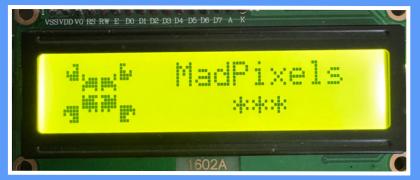

<picture>
    <source media="(prefers-color-scheme: dark)" srcset="https://github.com/Mad-Pixels/.github/raw/main/profile/banner.png">
    <source media="(prefers-color-scheme: light)" srcset="https://github.com/Mad-Pixels/.github/raw/main/profile/banner.png">
    
</picture>

# 📟 MadPixels Monitor — LCD Interface

This project is designed to display metrics on a 16x2 LCD screen via the serial interface. It supports synchronization, graphical visualization, and error handling for invalid input.

## ⚙️ Core Components
- LiquidCrystal — LCD control library (I2C).
- SerialHandshake — synchronization mechanism via Serial (based on serial_number and ACK exchange).
- ArduinoJson — for parsing JSON metrics from the serial port.
- MadScreen — manages welcome, error, and disconnect screens.
- MadChart — draws graphs and displays metric values based on incoming data.

## 🔌 How It Works
1. On startup, a welcome screen is shown `welcome_screen()`.
2. The device periodically sends its `serial_number` over Serial.
3. An external program _(e.g., a Go or Python script)_ should respond with `serial:ack::<serial_number>`.
4. Once synchronized, the device will start receiving and displaying JSON metrics.
5. If connection lost you will see disconnect screen.

## 📤 Expected Input Format
```json
{
  "metrics": [
    { "i": "TMP", "v": 25, "t": 1 },
    { "i": "HMD", "v": 60, "t": 1 }
  ]
}
```
- [i] — short metric identifier (max 3 characters)
- [v] — integer value
- [t] - type (0 = raw data, 1 = percentage)

## 📡 Example Data Sender (Go)
```go
payload := `{"metrics":[{"i":"TMP","v":24,"t":1}]}`
port.Write([]byte(payload + "\n"))
```
ACK must be sent beforehand:
```go
port.Write([]byte("serial:ack::1602MAD1MNTR-ad4ov42df4\n"))
```

📺 Supported Chart Types (can be changed in code or button)
- SPEC_PERCENTAGE_UNO
- BAR_PERCENTAGE
- GIS_PERCENTAGE
- COL_PERCENTAGE
- ROW_PERCENTAGE
- COL_RAW_DATA
- ROW_RAW_DATA

## 🛠 Dependencies
- LiquidCrystal (I2C)
- ArduinoJson
- Custom libraries: MadScreen, MadChart, SerialHandshake


